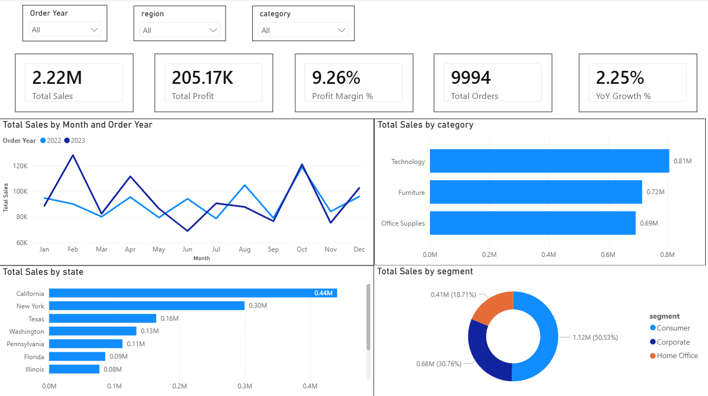
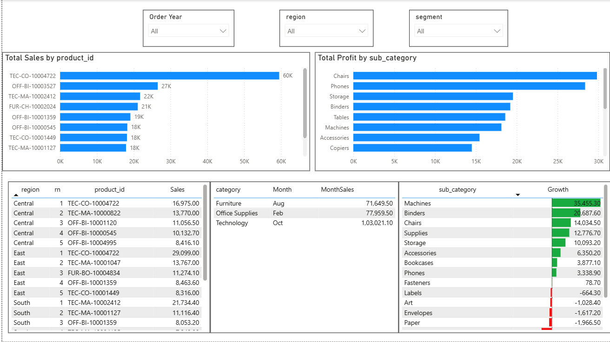
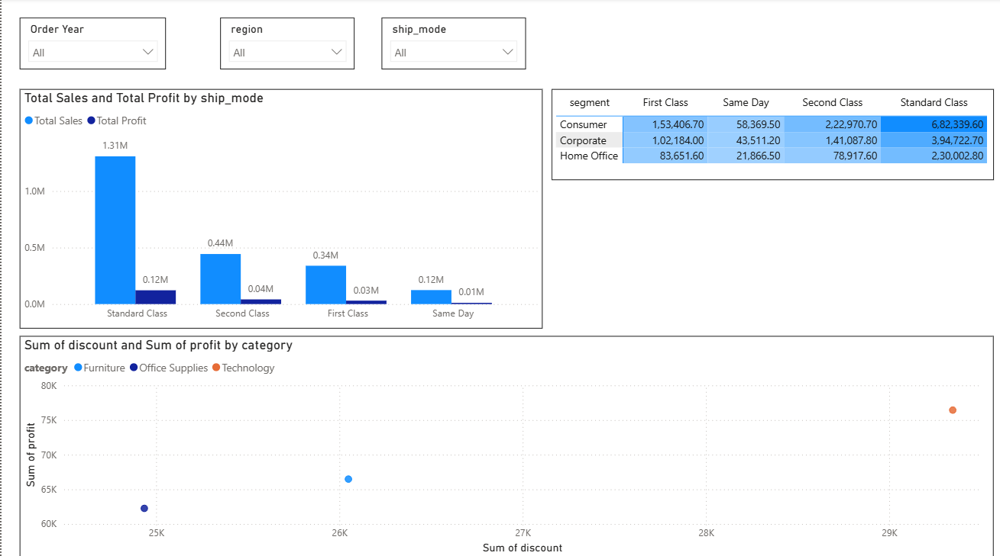

# Retail Orders Analytics — Python · SQL Server · Power BI

An end-to-end analytics project on a 9,994-row retail orders dataset. Raw CSV is cleaned and transformed with **Python (Pandas)**, loaded into **Microsoft SQL Server**, analysed with **T-SQL** (CTEs + window functions), and visualised in a **Power BI** dashboard.

**Author:** Siddhant Singh · [GitHub](https://github.com/singhsiddhant465)

---

## Overview

Raw transactional data rarely answers business questions directly. This project builds a small, reproducible ETL pipeline that turns a raw orders extract into a queryable SQL Server table, then layers T-SQL analysis and a Power BI dashboard on top to answer questions like:

1. Which products generate the most revenue?
2. What are the top 5 products in each region?
3. How do 2022 and 2023 sales compare month over month?
4. For each category, which month peaked?
5. Which sub-category grew the most year over year?
6. Where are margins highest — and do discounts actually erode profit?

## Architecture

```
orders.csv  ──►  Python / Pandas  ──►  SQL Server (retail.dbo.orders)  ──►  T-SQL analysis
   (raw)          clean + engineer          clean table                      +  Power BI
```

## Dataset

- **Source:** Kaggle — `ankitbansal06/retail-orders` (`orders.csv`)
- **Grain:** one row per order line · **9,994 rows**
- **Scope:** United States only, order dates spanning **2022–2023**

## ETL Pipeline (`etl_pipeline.py`)

1. **Extract** — read `orders.csv`, treating the placeholder strings `"Not Available"` and `"unknown"` in *Ship Mode* as missing values (`NaN`).
2. **Transform**
   - Column names standardised to `snake_case` (`Order Id` → `order_id`).
   - `order_date` parsed to a proper date type.
   - Three engineered columns:
     ```python
     discount   = list_price * discount_percent * 0.01
     sale_price = list_price - discount
     profit     = sale_price - cost_price
     ```
   - Money columns rounded to 2 decimals.
3. **Load** — create the `retail` database if needed and write the `dbo.orders` table.
   Uses `if_exists="replace"`, so **re-running the pipeline is idempotent** (no duplicate rows).

Connects to SQL Server with **Windows Authentication** by default (no password to store). SQL Authentication is supported via environment variables if preferred.

### Table schema (`retail.dbo.orders`)

| Column | Type | Notes |
|---|---|---|
| order_id | INT | |
| order_date | DATE | |
| ship_mode | VARCHAR(50) | nullable — cleaned placeholders |
| segment | VARCHAR(50) | |
| country / city / state | VARCHAR | |
| postal_code | VARCHAR(20) | |
| region | VARCHAR(50) | |
| category / sub_category | VARCHAR(50) | |
| product_id | VARCHAR(100) | |
| quantity | INT | |
| cost_price | DECIMAL(10,2) | kept for margin analysis |
| list_price | DECIMAL(10,2) | kept for margin analysis |
| discount_percent | INT | |
| discount | DECIMAL(10,2) | derived |
| sale_price | DECIMAL(10,2) | derived |
| profit | DECIMAL(10,2) | derived |

> Unlike a minimal version of this pipeline, `cost_price`, `list_price`, and
> `discount_percent` are retained so profit-margin and discount-impact questions
> can be answered in SQL and Power BI.

## SQL Analysis (`analysis_queries.sql`)

Nine T-SQL queries against `retail.dbo.orders`, built on **CTEs + window functions**
(`ROW_NUMBER`), **conditional aggregation** (`CASE WHEN`), and date-part
extraction. Queries 1–5 answer the core business questions; 6–9 add profit-margin,
discount-impact, top-states, and segment/ship-mode breakdowns.

## Power BI Dashboard

The dashboard connects **live to SQL Server** (`retail.dbo.orders`) and presents three pages:

### Executive Overview
KPI cards (sales, profit, margin %, YoY growth), a 2022-vs-2023 monthly trend, and sales by region / category / segment.



### Product & Category Deep Dive
Top-10 products, top-5 per region, best month per category, and sub-category growth.



### Operations
Ship-mode performance and a discount-vs-profit scatter.



Full build instructions (connection steps, DAX measures, page-by-page layout) are in
**[POWERBI_DASHBOARD_GUIDE.md](POWERBI_DASHBOARD_GUIDE.md)**.

## Tech Stack

- **Python** — Pandas, SQLAlchemy, pyodbc
- **Microsoft SQL Server** — storage + analytical T-SQL (queried via SSMS)
- **Power BI** — dashboard / visualisation
- **SQL techniques** — CTEs, `ROW_NUMBER()`, conditional aggregation, `YEAR()`/`MONTH()`

## How to Run

### Prerequisites
- Python 3.x and SQL Server running locally (queried with SSMS)
- ODBC Driver 17 (or 18) for SQL Server installed
- `orders.csv` downloaded (Kaggle: `ankitbansal06/retail-orders`)

### Steps

1. **Install dependencies**
   ```bash
   pip install -r requirements.txt
   ```

2. **(Optional) adjust connection settings.** Windows Authentication is used by
   default against `localhost`, so no password is needed. To change the server,
   database, driver, or use SQL Authentication, copy `.env.example` to `.env`
   and edit it (auto-loaded), or set the `MSSQL_*` environment variables.

3. **Run the ETL**
   ```bash
   python etl_pipeline.py
   ```
   This creates the `retail` database and loads `retail.dbo.orders` (9,994 rows).

4. **Run the analysis** — open `analysis_queries.sql` in SSMS and execute against the `retail` database.

5. **Build the dashboard** — follow `POWERBI_DASHBOARD_GUIDE.md` to connect Power BI to `retail.dbo.orders`.

## Project Structure

```
Retail-Orders-Analytics/
├── etl_pipeline.py             # Extract → clean → engineer → load to SQL Server
├── analysis_queries.sql        # 9 analytical T-SQL queries
├── POWERBI_DASHBOARD_GUIDE.md  # Power BI build guide (connection, DAX, layout)
├── images/                     # dashboard screenshots used in this README
├── requirements.txt
├── .env.example                # template for connection settings
├── .gitignore
└── README.md
```

## Notes & Limitations

- **Security:** Windows Authentication is used by default, so no password is
  stored. If SQL Authentication is used instead, credentials come from
  environment variables / a git-ignored `.env` — never committed in plaintext.
- **Dataset scope:** US orders only, 2022–2023, so year-over-year comparisons
  are limited to those two years.

## License

Open-source for educational and portfolio purposes.
